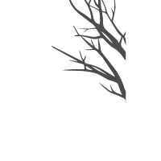

# TreeCredz

## Links to the repositories
[Client App](https://github.com/TeamRekursion/treecredz-client-hackoff)
 
[Admin / Shopkeeper App](https://github.com/TeamRekursion/treecredz-admin-hackoff)
 
 
You can also find the APKs attached in the release section

## Link to presentation
[Presentation](https://docs.google.com/presentation/d/1kJAYrzEVvTLgkt_rVC-dldIHNVTJ4bvGvfsyZP2NecE/edit?usp=sharing)

## Link to videos
[Demo (YouTube)](https://youtu.be/ogJH8bNf0u4)
 

## Our Solution
The first thing which came to our mind was that what is the current level of Co2 which is being consumed and traded all across the globe, or which countries are the major contributors? We realized that there is a lack of awareness among the people, as there is no place where people can see the statistics related to carbon footprint, therefore we thought that a ‘Statistics’ Page should be included in the application.
 
 
The next thing which we thought was how to reduce the current level of carbon footprint, and the thought of ‘TREES’ immediately came to our mind. Therefore,  we decided that planting more trees can help to reduce the Co2 Level significantly. Now, we had to think of ways which could result in the planting of more and more trees. That’s when we came up the main idea:
 
 
We often go to stores in the mall and after purchasing things, we often link our mobile number with the company, and according to the shopping amount certain points are added to our number which can be redeemed whenever a user wants. 
 
 
We aim to tie up with these companies so that instead of adding these points to the user’s company account, the user can choose to add these points to our app ‘TreeCredz’. Now, what can the users do with these credits? The users can use these credits to purchase trees of varying credits. Once the user has purchased trees on our app(they will get a unique tree code), we will plant the purchased trees on their behalf, and once planted we will share the image and the location of the planted tree for transparency.
